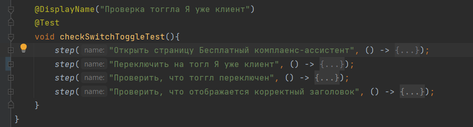
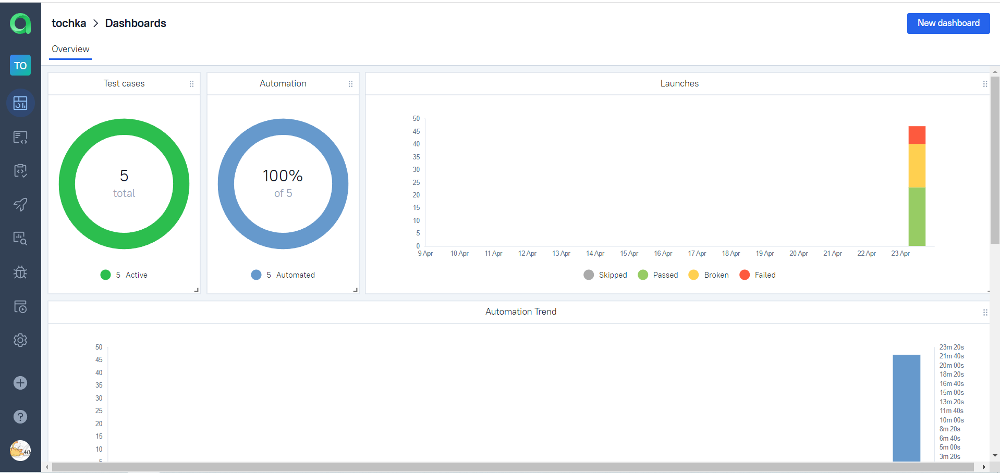
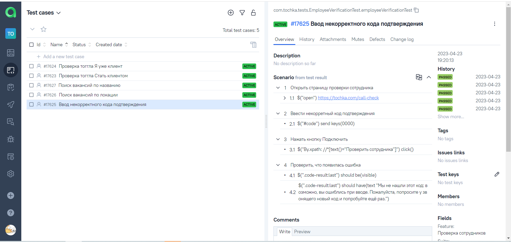
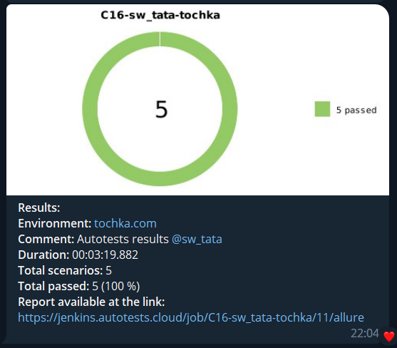

# Автотесты для банка [Точка](https://tochka.com/) 

Небольшой проект для банка с автотестами  и интеграциями в рабочие сервисы. Не стала использовать в данном случае PageObject, 
так как тестов немного, а в них - мало повторяющегося кода. Использовала лямбда-степы Allure, в результате получила очень читабельный код: 



## Технологии и инструменты 


## Как запустить удаленно:
Потребуется файл remote.properties следующего содержания:

```browser = <browser type>
browserVersion = <browser version>
baseURL = https://tochka.com
remoteUrl = <server url for remote run, I used Selenoid>
isRemote = true
```
Команда ```gradle clean test``` 
и установить переменную окружения env=remote

[Готовый Build](https://jenkins.autotests.cloud/job/C16-sw_tata-tochka/) для удаленного запуска в Jenkins.

## Allure TestOps
Подключила интеграцию с Allure TestOps, кейсы подтягиваются со всеми шагами:




### Телеграм бот:
Уведомляет ответственного, содержит краткий отчет о прохождении и ссылку на Allure отчет:


